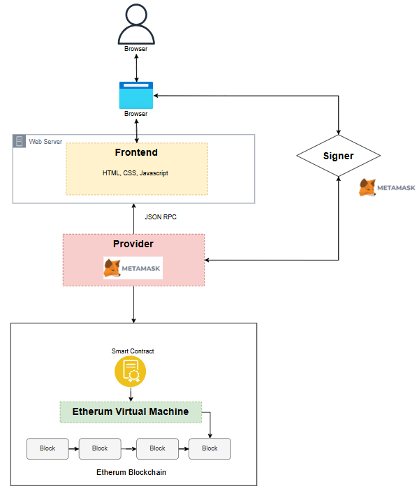

# 🔮 Prediction Market DApp

A decentralized prediction market platform built on Ethereum that allows users to create markets, place bets on future events, and earn rewards for correct predictions.

## 📋 Table of Contents

- [Quick Start](#-quick-start)
- [First-Time Setup Guide](#-first-time-setup-guide)
- [Features](#-features)
- [System Architecture & Design](#-system-architecture--design)
- [Project Structure](#-project-structure)
- [Configuration](#-configuration)
- [Troubleshooting](#-troubleshooting)
- [Usage](#-usage)
- [Smart Contract Functions](#-smart-contract-functions)
- [Frontend Features](#-frontend-features)
- [Security Features](#-security-features)
- [Fee Distribution Examples](#-fee-distribution-examples)
- [Future Enhancements](#-future-enhancements)
- [References](#-references)

## 🏃 Quick Start

1. **Install prerequisites:** Node.js v16+ and MetaMask browser extension
2. **Clone and install:**
   ```bash
   git clone https://github.com/your-username/SC4053-Blockchain-Technology.git
   cd SC4053-Blockchain-Technology
   npm install
   ```
3. **Configure MetaMask:** Add network with RPC `http://127.0.0.1:8545`, Chain ID `31337`
4. **Import test accounts:** Import at least 5 accounts (1 creator + 3 arbitrators + 1 bettor) - See [TEST_ACCOUNTS.md](./TEST_ACCOUNTS.md) for all 20 available accounts
5. **Start blockchain (Terminal 1):** `npm run node`
6. **Deploy contract (Terminal 2):** `npm run deploy:localhost`
7. **Start frontend (Terminal 3):** `cd frontend && python -m http.server 8080`
8. **Open browser:** Navigate to `http://localhost:8080`, switch MetaMask to "Localhost 8545", and connect wallet

See [First-Time Setup Guide](#-first-time-setup-guide) below for detailed step-by-step instructions.

## 🚀 First-Time Setup Guide

### Step 0: Removing pre-existing configurations

If you have ran this dApp before, be sure to remove all local account imports and local networks before re-deploying the hardhat node and smart contract. Otherwise there will be cache issues in the MetaMask wallet. 

### Step 1: Prerequisites Installation

Before running this project, ensure you have the following installed:

1. **Node.js (v16 or later)**

   - Download from [nodejs.org](https://nodejs.org/)
   - Verify installation: `node --version`

2. **MetaMask Browser Extension**

   - Install from [metamask.io](https://metamask.io/)
   - Create a wallet

3. **Python (for frontend server)**
   - Usually comes with Node.js
   - Verify installation: `python --version` or `python3 --version`

### Step 2: Project Installation

1. **Clone the repository**

   ```bash
   git clone https://github.com/your-username/SC4053-Blockchain-Technology.git
   cd SC4053-Blockchain-Technology
   ```

2. **Install dependencies**
   ```bash
   npm install
   ```
   This will install Hardhat, OpenZeppelin contracts, and all required packages.

### Step 3: Start the Local Environment

You need to open **THREE separate terminal windows**:

**Terminal 1 - Start Local Blockchain:**

```bash
npm run node
```

This starts a local Ethereum blockchain at `http://127.0.0.1:8545`. Keep this terminal running.

**Terminal 2 - Deploy Smart Contract:**

```bash
npm run deploy:localhost
```

This deploys the PredictionMarket contract to your local blockchain.

**Terminal 3 - Start Frontend Server:**

```bash
cd frontend
python -m http.server 8080
```

### Step 4: MetaMask Configuration

Configure MetaMask to connect to the local Hardhat network:

1. Open MetaMask extension
2. Click the menu at the top right
3. Select "Networks"
4. Select "Add a custom network"
5. Enter the following details:
   - **Network Name:** `Localhost 8545`
   - **RPC URL:** `http://127.0.0.1:8545`
   - **Chain ID:** `31337`
   - **Currency Symbol:** `ETH`
6. Click "Save"

### Step 5: Import Test Accounts

Hardhat provides 20 pre-funded test accounts (each with 10,000 ETH). You need to import multiple accounts for testing.

**IMPORTANT:** You need at least **5 accounts** total:

- 1 account for creating markets
- 3 accounts to act as arbitrators (minimum required)
- 1 account for placing bets

**Quick Import - First Account:**

1. In MetaMask, click the account drop down menu (top left)
2. Select "Add wallet"
3. Select "Import an account"
4. **Paste this private key:** `0xac0974bec39a17e36ba4a6b4d238ff944bacb478cbed5efcae784d7bf4f2ff80`
5. Click "Import"

This gives you **Account #0** (`0xf39Fd6e51aad88F6F4ce6aB8827279cffFb92266`) with 10,000 ETH.

**Import Additional Accounts:**

For a complete list of all 20 available test accounts with their addresses and private keys, see **[TEST_ACCOUNTS.md](./TEST_ACCOUNTS.md)**.

That document includes:

- All 20 test account addresses and private keys

**Minimum Requirement:** Import at least 4 more accounts (3 for arbitrators, 1 for placing bets)

### Step 6: Access the Application

1. Open your web browser
2. Navigate to `http://localhost:8080`
3. MetaMask should prompt you to connect
4. **Switch MetaMask network to "Localhost 8545"**
5. Click "Connect Wallet" button in the application
6. Approve the connection in MetaMask

You should now see:

- Your wallet address displayed
- Your balance (~10,000 ETH)
- Ability to create markets and place bets

### Step 7: Test the Application

#### Create Your First Market

1. Click on the "Create Market" tab
2. Fill in the form:
   - **Description:** "Will it rain tomorrow?"
   - **Outcomes:** Add at least two outcomes (e.g., "Yes", "No")
   - **Resolution Time:** Select a date/time at least 1 minute in the future
   - **Arbitrator Addresses:** Add 3 or more arbitrator addresses
     - Example: Use addresses from Accounts #1, #2, #3 (see [TEST_ACCOUNTS.md](./TEST_ACCOUNTS.md))
     - Can have up to 21 arbitrators
     - If votes tie, market becomes a draw and bets are refunded
   - **Creation Fee:** `0.001` ETH (minimum)
3. Click "Create Market"
4. Confirm the transaction in MetaMask

#### Place a Bet

1. Go to "Browse Markets" tab
2. You should see your newly created market
3. Click on an outcome
4. Enter bet amount (e.g., `0.1` ETH)
5. Click "Place Bet"
6. Confirm transaction in MetaMask

**Note:** Creators and arbitrators cannot bet in the market they created or are arbitrating respectively

### Stopping the Application

When you're done testing:

1. Press `Ctrl+C` in each of the three terminal windows
2. Close the browser tab
3. MetaMask will automatically disconnect

### Restarting After Shutdown

**IMPORTANT:** When you restart the local blockchain (`npm run node`), it creates a fresh blockchain state. You must:

1. Start the blockchain again (`npm run node`)
2. Deploy the contract again (`npm run deploy:localhost`)
3. **Reset MetaMask account:**
   - Open MetaMask → Settings → Advanced
   - Click "Clear activity tab data" or "Reset Account"
   - This clears the transaction history for the new blockchain instance

## ✨ Features

### Core Features

- **Betting System**: Users can place bets on different outcomes using ETH
- **Category Filtering**: Filter markets by category in Browse Markets and My Bets tabs
- **Collusion Resistance**: Markets resolve with simple majority, preventing single arbitrator manipulation
- **Consolidated Bet Display**: Multiple bets on same outcome are automatically grouped
- **Draw Handling**: Automatic bet refunds (minus fees) when arbitrator votes tie
- **Duplicate Outcome Prevention**: Smart contract and frontend validation prevents duplicate outcomes
- **Dynamic Pricing**: Market probabilities reflect betting volumes in real-time
- **Fair Arbitrator Compensation**: Only arbitrators who voted correctly receive fees
- **Fee Distribution**: 2.5% total fees split between platform (1.5%) and arbitrators (1%)
- **Market Creation**: Users can create new prediction markets with custom descriptions, outcomes, categories, and resolution times
- **Market Categories**: Organize markets by 8 categories (Sports, Politics, Crypto, Weather, Entertainment, Science, Business, Other)
- **Market Discovery**: Browse active and resolved markets with real-time probability calculations
- **Multi-Arbitrator System**: Markets require 3-21 arbitrators for decentralized resolution
- **Potential Earnings Calculator**: Real-time calculation of potential payouts for active markets
- **Voting Mechanism**: Arbitrators vote on outcomes with simple majority consensus
- **Winnings Distribution**: Winners can withdraw their proportional share of the total bet pool
- **Withdrawal Tracking**: System tracks and prevents double-withdrawals

## 🏛 System Architecture & Design

### System Architecture Diagram



### Key Design Highlights

**Multi-Arbitrator Voting (3-21 arbitrators):**

- Prevents single point of failure
- Multi-arbitrator voing with simple majority (>50%) prevents single point of failure and provides resilience against minority collusion
- Economic incentives: only correct voters earn fees
- Draw handling when votes tie (fair refunds for all)

**Security Features:**

- ReentrancyGuard on all withdrawal functions
- Conflict of interest prevention (creators/arbitrators can't bet)
- Double-withdrawal protection
- Checks-Effects-Interactions pattern

## 🏗 Project Structure

```
prediction-market-dapp/
├── contracts/
│   └── PredictionMarket.sol       # Main smart contract
├── scripts/
│   └── deploy.js                  # Deployment script
├── frontend/
│   ├── index.html                 # Main web interface
│   ├── css/
│   │   └── styles.css             # Application styles
│   └── js/
│       └── app.js                 # Frontend JavaScript logic
├── artifacts/                      # Compiled contract artifacts
├── cache/                          # Hardhat cache
├── hardhat.config.js              # Hardhat configuration
├── package.json                   # Dependencies and scripts
├── TEST_ACCOUNTS.md               # Test account addresses and private keys (20 accounts)
└── README.md                      # This file
```

## ⚙️ Configuration

### Network Configuration

The project is deployed on local development network (configured in `hardhat.config.js`):

- **Local Development**: Hardhat network (Chain ID: 31337)
- **Localhost**: Local Hardhat node at `http://127.0.0.1:8545`

### Smart Contract Parameters

Key parameters in the PredictionMarket contract:

- **Platform Fee:** 1.5% (150 basis points) - Goes to contract owner
- **Arbitrator Fee:** 1.0% (100 basis points) - Split among arbitrators who voted correctly
- **Total Fees:** 2.5% combined
- **Minimum Resolution Time:** 1 minute from market creation
- **Maximum Outcomes:** 10 per market
- **Minimum Arbitrators:** 3 required
- **Maximum Arbitrators:** 21 allowed
- **Minimum Creation Fee:** 0.001 ETH
- **Voting Mechanism:** Simple majority (more than 50%)

## 🔧 Troubleshooting

### Common Issues

1. **"MetaMask not detected"**

   - Make sure you're accessing via `http://localhost:8080`, not by opening the HTML file directly
   - Ensure MetaMask extension is installed and enabled

2. **"Wrong network" error**

   - Check that MetaMask is connected to "Localhost 8545" network
   - Verify the Chain ID is 31337

3. **"Nonce too high" or transaction errors**

   - Reset MetaMask account: Settings → Advanced → Reset Account
   - This happens when you restart the local blockchain

4. **"Contract not deployed" or undefined address**

   - Make sure you ran `npm run deploy:localhost` in Terminal 2
   - Verify the contract address is correct in `frontend/js/app.js`

5. **"Insufficient funds" error**

   - Ensure you imported the test account with 10,000 ETH
   - Check you're connected to the correct account in MetaMask

6. **Python server won't start**

   - Try `python3 -m http.server 8080` instead

7. **"Port 8545 already in use"**
   - Another process is using that port
   - Kill the process or restart your computer
   - On Windows: `netstat -ano | findstr :8545` then `taskkill /PID <process_id> /F`

## 📱 Usage

### Creating a Market

1. Connect your MetaMask wallet
2. Navigate to "Create Market" tab
3. Fill in market details:
   - Description of the event to predict
   - Possible outcomes (2-10 options)
   - Resolution date and time
   - Select Category of your market
   - Arbitrator address (who will resolve the market)
   - Creation fee (minimum 0.001 ETH)
4. Submit transaction

### Placing Bets

1. Browse active markets in "Browse Markets" tab
2. Select an outcome by clicking on it
3. Enter bet amount in ETH
4. Click "Place Bet" and confirm transaction

### Resolving Markets (Arbitrators)

1. Only designated arbitrators can vote on market outcomes
2. Markets can only be resolved after the resolution time has passed
3. Each arbitrator casts one vote for what they believe is the correct outcome
4. **Winning Conditions:**
   - Market resolves when any outcome receives majority votes (>50%)
   - If all arbitrators vote but no majority: Market declared a **DRAW**
5. **Draw Scenario:** All bets are refunded minus 2.5% fees

### Withdrawing Winnings

1. After market resolution, winners can withdraw their share
2. Winnings are calculated proportionally based on bet amounts
3. Total fees (2.5%) are deducted: 1.5% platform + 1% arbitrators
4. Go to resolved market and click "Withdraw Winnings"
5. **Draw Markets:** All bettors receive refunds minus fees

### Claiming Arbitrator Fees

1. Arbitrators can claim fees after market is resolved
2. **Eligibility:**
   - For normal resolution: Only arbitrators who voted for the **winning outcome**
   - For draws: All arbitrators who **voted** (any outcome)
   - Non-voters receive nothing
3. Fees are split equally among eligible arbitrators

### Understanding Arbitrator Fees

**How Fees Are Collected:**

- 1% of every winning payout goes to the arbitrator fee pool
- In draw scenarios, 1% of every refund contributes to the arbitrator fee pool
- Total collected fees are displayed transparently on resolved markets

**Fee Distribution Rules:**

| Scenario       | Who Gets Fees                                  | Split Method                     |
| -------------- | ---------------------------------------------- | -------------------------------- |
| **Normal Win** | Only arbitrators who voted for winning outcome | Equal split among correct voters |
| **Draw**       | All arbitrators who voted (any outcome)        | Equal split among all voters     |
| **No Vote**    | No fees earned                                 | N/A                              |

## 📜 Smart Contract Functions

### State-Changing Functions

| Function               | Description                                              | Access Restrictions                                             |
| ---------------------- | -------------------------------------------------------- | --------------------------------------------------------------- |
| `createMarket()`       | Create a new prediction market with multiple arbitrators | Requires 0.001 ETH minimum fee                                  |
| `placeBet()`           | Place a bet on market outcome                            | Cannot be creator or arbitrator of market                       |
| `voteOnOutcome()`      | Vote on winning outcome after resolution time            | Designated arbitrators only                                     |
| `withdrawWinnings()`   | Withdraw winnings or refund after market resolves        | Users with winning/refundable bets only                         |
| `claimArbitratorFee()` | Claim arbitrator fee share after market resolves         | Eligible arbitrators only (voted correctly or any vote in draw) |

### View Functions (Read-Only)

| Function                     | Description                                          | Returns                  |
| ---------------------------- | ---------------------------------------------------- | ------------------------ |
| `getMarketInfo()`            | Get complete market details including draw status    | MarketInfo struct        |
| `getOutcomeProbabilities()`  | Get current probability percentages for all outcomes | uint256[] (basis points) |
| `getAllActiveMarkets()`      | Get IDs of all unresolved markets                    | uint256[] market IDs     |
| `getAllResolvedMarkets()`    | Get IDs of all resolved markets                      | uint256[] market IDs     |
| `getUserBets()`              | Get all bets placed by specific user                 | UserBet[] struct array   |
| `getUserBetAmount()`         | Get user's total bet amount for specific outcome     | uint256 (wei)            |
| `getUserMarkets()`           | Get all markets created by specific user             | uint256[] market IDs     |
| `hasArbitratorVoted()`       | Check if arbitrator has cast their vote              | bool                     |
| `hasUserWithdrawn()`         | Check if user has withdrawn from market              | bool                     |
| `getArbitratorFeeInfo()`     | Get comprehensive arbitrator fee information         | Multiple return values   |
| `getArbitratorVoteDetails()` | Get voting status for all arbitrators in market      | Multiple arrays          |

### Owner-Only Functions

| Function              | Description                               | Access              |
| --------------------- | ----------------------------------------- | ------------------- |
| `setPlatformFee()`    | Update platform fee percentage (max 10%)  | Contract owner only |
| `setArbitratorFee()`  | Update arbitrator fee percentage (max 5%) | Contract owner only |
| `emergencyWithdraw()` | Emergency withdrawal of contract balance  | Contract owner only |

## 🖥 Frontend Features

### Modern UI/UX

- **Real-time Updates**: Live probability calculations and bet tracking
- **Wallet Integration**: Seamless MetaMask connection

### Market Display

- **Market Cards**: Clean, organized display of market information
- **Probability Bars**: Visual representation of outcome probabilities
- **Status Indicators**: Clear indication of market status (active/resolved/expired/draw)
- **Time Display**: Human-readable creation and resolution times
- **Draw Indicators**: Visual notification when markets end in a tie

### Arbitrator Features

- **Fee Transparency**: Real-time display of arbitrator fee eligibility and amounts
- **Voting Status**: Shows which arbitrators have voted and their choices
- **Fee Claiming**: One-click interface to claim arbitrator fees
- **Eligibility Tracking**: Clear indication of why arbitrators are/aren't eligible for fees
- **Draw Handling**: Special UI for draw scenarios where all voters share fees

### Bettor Features

- **Winnings Calculator**: Real-time calculation of potential payouts
- **Refund Display**: Clear indication of refund amounts in draw scenarios
- **Withdrawal Tracking**: Shows whether winnings/refunds have been claimed
- **Fee Breakdown**: Transparent display of platform and arbitrator fees

### User Experience

- **Tabbed Interface**: Easy navigation between browse, create, and personal bets
- **Form Validation**: Client-side validation for all inputs
- **Error Handling**: Clear error messages and success notifications
- **Transaction Tracking**: Real-time transaction status updates
- **Visual Feedback**: Color-coded sections for different states (unclaimed/claimed/ineligible)

## 🔐 Security Features

### Smart Contract Security

- **ReentrancyGuard**: Protection against reentrancy attacks on withdrawals
- **Access Control**: Role-based permissions using OpenZeppelin Ownable
- **Input Validation**: Validation of all input parameters
- **Safe Math**: Using Solidity 0.8+ built-in overflow protection
- **Unique Arbitrators**: Prevents duplicate arbitrator addresses
- **Conflict of Interest Prevention**: Market creators and arbitrators cannot bet on their own markets
- **Double-Withdrawal Protection**: Tracks withdrawal status to prevent duplicate claims
- **Fee Claim Protection**: Arbitrators can only claim fees once per market

### Fairness & Game Theory

- **Majority Voting**: Simple majority consensus (>50%) prevents single arbitrator manipulation and minority collusion
- **Incentive Alignment**: Only correct voters earn fees, discouraging collusion
- **Draw Handling**: Fair refunds when consensus cannot be reached
- **No Free Riders**: Non-participating arbitrators receive no compensation

### Frontend Security

- **Input Sanitization**: All user inputs are validated
- **Wallet Integration**: Secure interaction with MetaMask
- **Error Boundaries**: Graceful handling of blockchain errors
- **Address Validation**: Ethereum address format verification

## 💰 Fee Distribution Examples

### Example 1: Normal Resolution (3 Arbitrators, 2 Vote Correctly)

- **Market**: "Will it rain tomorrow?"
- **Total Pool**: 100 ETH
- **Arbitrator A**: Votes "Yes" ✅
- **Arbitrator B**: Votes "Yes" ✅
- **Arbitrator C**: Votes "No" ❌
- **Outcome**: "Yes" wins (2/3 majority)

**Winner with 50 ETH bet receives:**

- Gross winnings: 50 ETH
- Platform fee (1.5%): -0.75 ETH
- Arbitrator fee (1%): -0.5 ETH
- **Net payout: 48.75 ETH**

**Arbitrator fees:**

- Total arbitrator fees collected: 1 ETH (1% of 100 ETH total pool)
- Eligible arbitrators: A and B (voted correctly)
- Split between A and B only: **0.5 ETH each**
- Arbitrator C gets: **0 ETH** (voted wrong)

### Example 2: Draw (4 Arbitrators, 2-2 Tie)

- **Market**: "Will candidate win election?"
- **Total Pool**: 200 ETH
- **Arbitrator A**: Votes "Yes" ✅
- **Arbitrator B**: Votes "Yes" ✅
- **Arbitrator C**: Votes "No" ✅
- **Arbitrator D**: Votes "No" ✅
- **Outcome**: **DRAW** (no majority)

**All bettors receive refund:**

- If you bet 10 ETH total on any outcomes
- Platform fee (1.5%): -0.15 ETH
- Arbitrator fee (1%): -0.1 ETH
- **Refund: 9.75 ETH**

**Arbitrator fees:**

- Total arbitrator fees: 2 ETH (1% of 200 ETH)
- Split among ALL who voted (A, B, C, D): **0.5 ETH each**
- Non-voters get: **0 ETH**

### Example 3: Low Participation (5 Arbitrators, Only 3 Vote)

- **Total Pool**: 150 ETH
- **Arbitrator A**: Votes "Yes" ✅
- **Arbitrator B**: Votes "Yes" ✅
- **Arbitrator C**: Votes "Yes" ✅
- **Arbitrator D**: Doesn't vote ❌
- **Arbitrator E**: Doesn't vote ❌
- **Outcome**: "Yes" wins (3/5 majority)

**Arbitrator fees split:**

- Total arbitrator fees collected: 1.5 ETH (1% of 150 ETH)
- Only A, B, C receive fees: **0.5 ETH each (equal split)**
- D and E get: **0 ETH** (didn't participate)

## 🚧 Future Enhancements

- **Reputation System**: Track arbitrator accuracy and participation rates
- **Oracle Integration**: Automatic resolution using Chainlink or other oracles
- **Social Features**: Market comments and discussion threads
- **Mobile App**: Native mobile application for iOS and Android
- **Advanced Analytics**: Detailed market statistics and user insights
- **Dispute Resolution**: Multi-stage arbitration for contentious outcomes

## 📚 References

- [Ethereum Documentation](https://ethereum.org/developers/)
- [OpenZeppelin Contracts](https://docs.openzeppelin.com/contracts/)
- [Hardhat Documentation](https://hardhat.org/docs/)
- [Augur Protocol](https://www.augur.net/) - Decentralized prediction market platform
- [Forepredict](https://forepredict.io/technology) - Modern prediction market implementation (design inspiration)
- [Course GitHub Repository](https://github.com/BlockchainCourseNTU/resource/)

---
